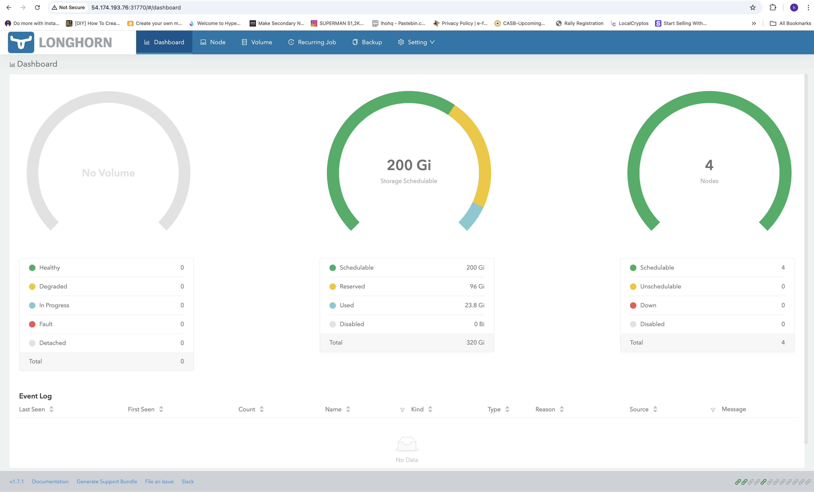
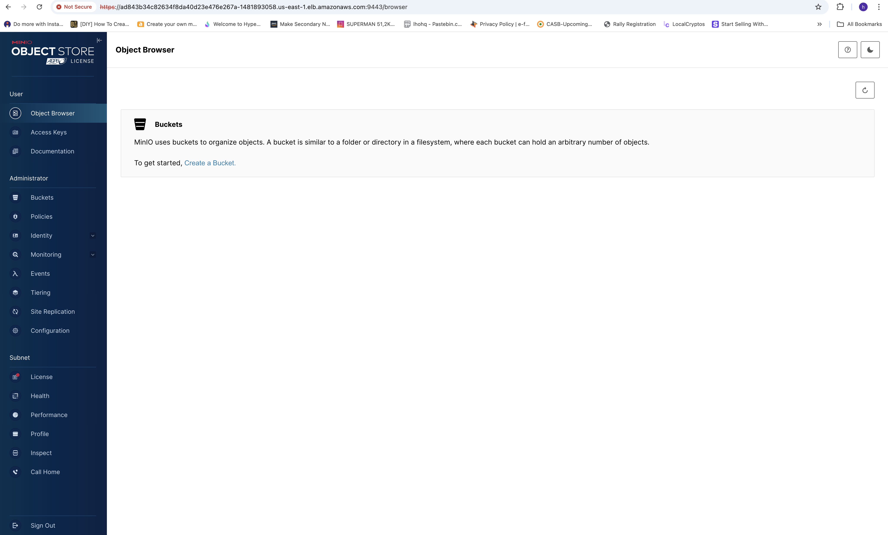
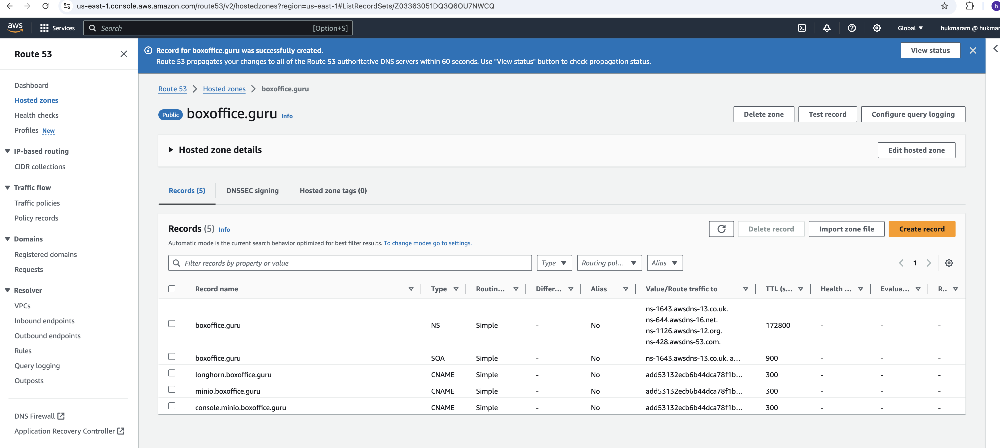
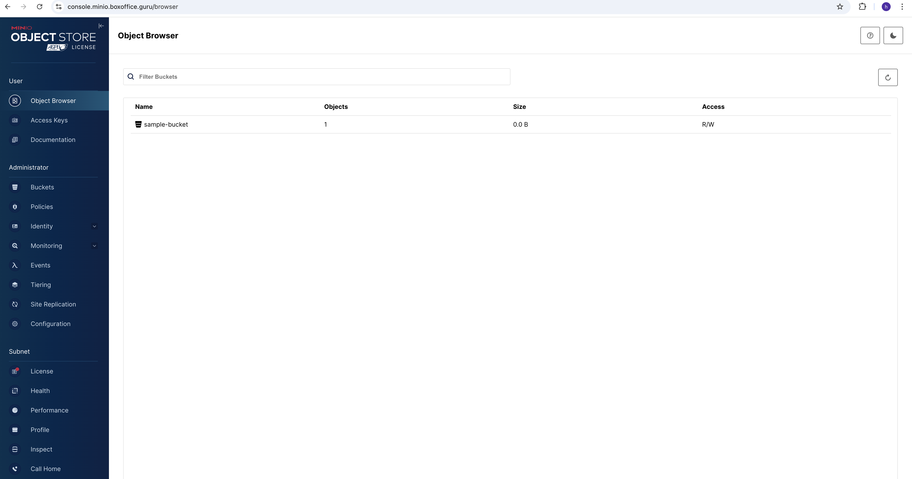
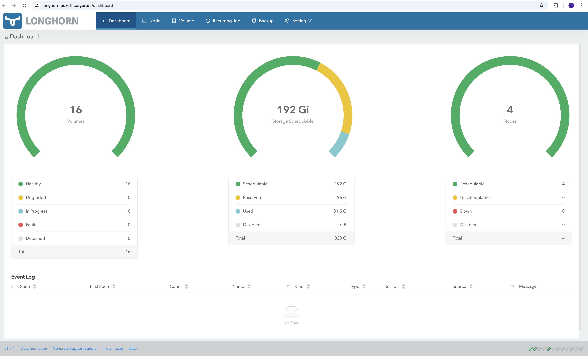
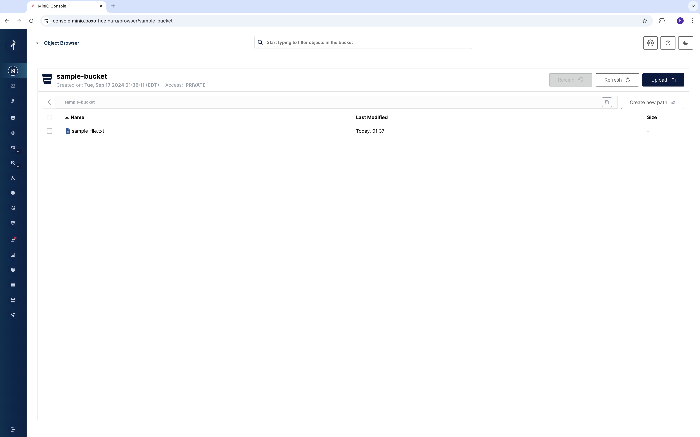

# EKS_MINIO_HA

TODO: Automate infrastructure creation using Iac. 

1. Create EKS cluster using following command-
bash```
eksctl create cluster \
  --name minio-cluster \
  --version 1.27 \
  --region us-east-1 \
  --nodegroup-name linux-nodes \
  --node-type t3.medium \
  --nodes 4 \
  --nodes-min 4 \
  --nodes-max 6 \
  --managed
```

2. Verify-
bash```
kubectl get nodes
```

3. Install helm locally.

5. create minio namespace
bash```
kubectl create namespace minio
```

6. Connect to EKS nodes and execute following commands (necessary to run longhorn)-
bash```
sudo apt update
sudo apt install open-iscsi
``` 

7. install longhorn (modify values.yaml if required)
bash```
helm install minio minio/minio \
  --namespace minio \
  --set replicas=4 \
  --set persistence.size=3Gi
```


8. Deploy minio operator
bash```
helm repo add minio-operator https://operator.min.io
helm search repo minio-operator
helm install \
  --namespace minio-operator \
  --create-namespace \
  operator minio-operator/operator
```

9. Modify longhorn settings to use longhorn as default storageclass and 4 replica count.

10. Install minio tenant in HA mode (Minio in HA needs minimum 4 nodes). Modify values.yaml and run- 
bash```
helm repo add minio-operator https://operator.min.io
helm install \
--namespace minio \
--create-namespace \
--values minio-values.yaml \
minio minio-operator/tenant
```

minio dashboard can be accessed at loadbalancer endpoint.



11. Install nginx ingress controller
bash```
helm repo add ingress-nginx https://kubernetes.github.io/ingress-nginx
helm repo update
helm install nginx-ingress ingress-nginx/ingress-nginx \
  --namespace ingress-nginx \
  --create-namespace \
  --set controller.service.type=LoadBalancer
```

12. Verify Nginx installation-
`kubectl get services -o wide -w -n ingress-nginx`

13. Create three CNAME records for minio hl, minio console and longhorn in the route 53 hosted zone and point them to the nginx load balancer.



14. Create kubernetes secrets for ssl certificates, we are using openssl to generate self signed certificates (We could also create a single certificate for all subdomains).
bash```
openssl req -x509 -nodes -days 365 -newkey rsa:2048 -keyout longhorn-tls.key -out longhorn-tls.crt -subj "/CN=longhorn.boxoffice.guru/O=minio"
openssl req -x509 -nodes -days 365 -newkey rsa:2048 -keyout minio-tls.key -out minio-tls.crt -subj "/CN=minio.boxoffice.guru/O=minio"
openssl req -x509 -nodes -days 365 -newkey rsa:2048 -keyout console.minio-tls.key -out console.minio-tls.crt -subj "/CN=console.minio.boxoffice.guru/O=minio"

kubectl create secret tls longhorn-tls --cert=longhorn-tls.crt --key=longhorn-tls.key -n longhorn-system
kubectl create secret tls minio-tls --cert=minio-tls.crt --key=minio-tls.key -n minio
kubectl create secret tls console-minio-tls --cert=console.minio-tls.crt --key=console.minio-tls.key -n minio
```

15. We can also handle SSL termination at the AWS ELB level instead of NGINX.

16. Write ingress resource for longhorn gui, minio console and minio hl. Apply ingress resource using following commands-
bash```
kubectl apply -f ingress-longhorn-ss.yaml
kubectl apply -f ingress-minio-ss.yaml
kubectl get ingress -n longhorn-system
kubectl get ingress -n minio
```

17. When using self signed certificate, browsers don't trust them and display warning so let's congifure trusted CA (let's encrypt)
bash```
kubectl apply -f https://github.com/jetstack/cert-manager/releases/download/v1.7.1/cert-manager.yaml
kubectl apply -f cluster-issuer.yaml 
kubectl apply -f ingress-longhorn-ca.yaml
kubectl apply -f ingress-minio-ca.yaml 
```

Make sure to delete previously created self signed secrets.

18. Reload NGINX Controller: 
bash```
kubectl rollout restart deployment nginx-ingress-ingress-nginx-controller -n ingress-nginx
```




19. Install minio client locally in mac- 
bash```
brew install minio/stable/mc
mc --help
```

20. Create minio access_key and secret using console.

21. Configure minio client-
bash```
bash +o history
mc alias set myminio https://minio.boxoffice.guru ACCESS_KEY SECRET_KEY
bash -o history
```

22. Create a bucket and upload sample file to it
bash```
mc mb myminio/sample-bucket
touch sample_file.txt
mc cp sample_file.txt myminio/sample-bucket
```

